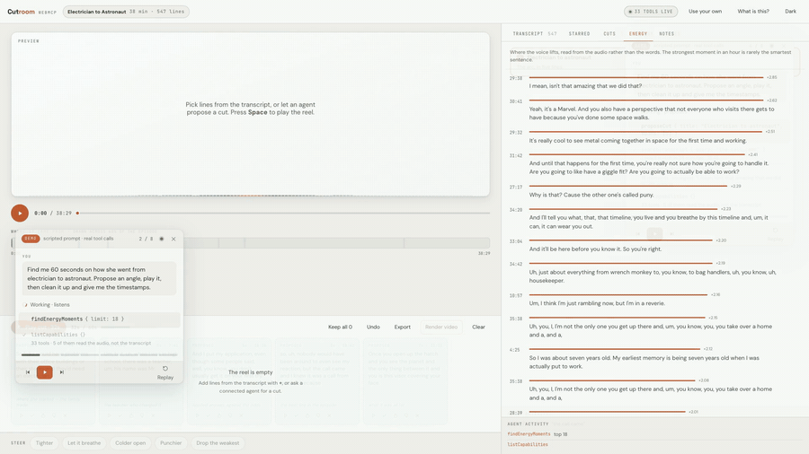
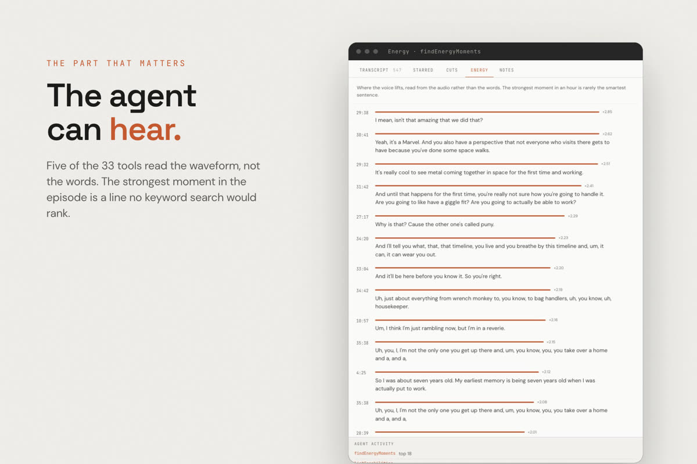
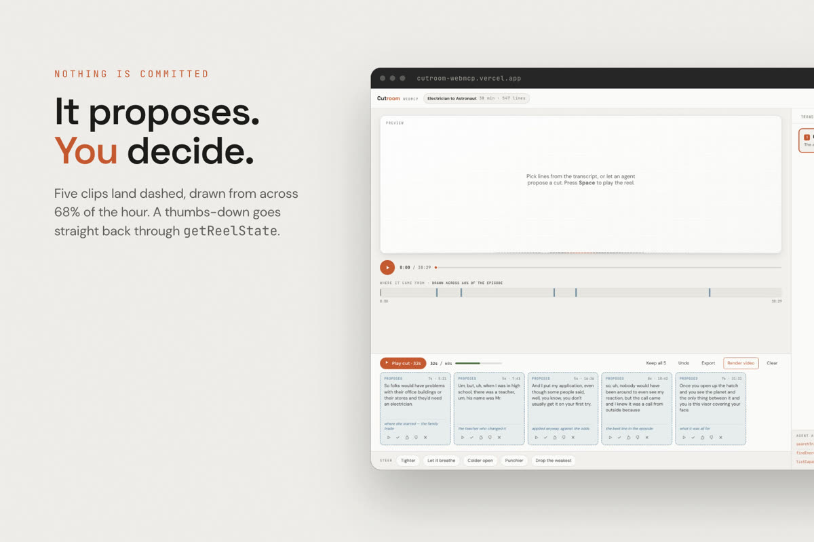
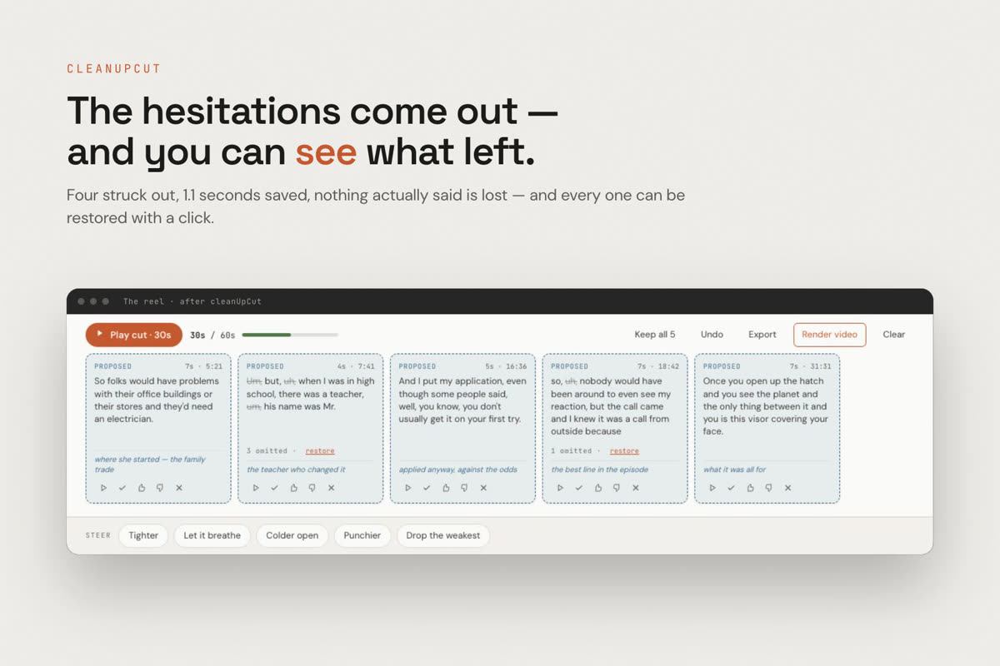
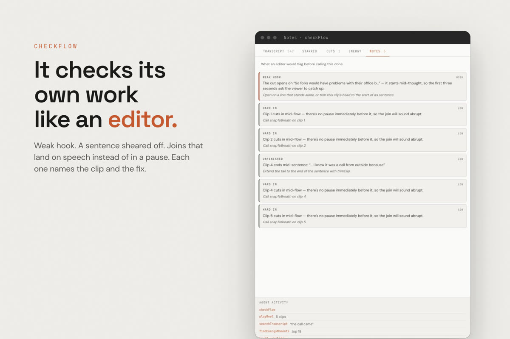
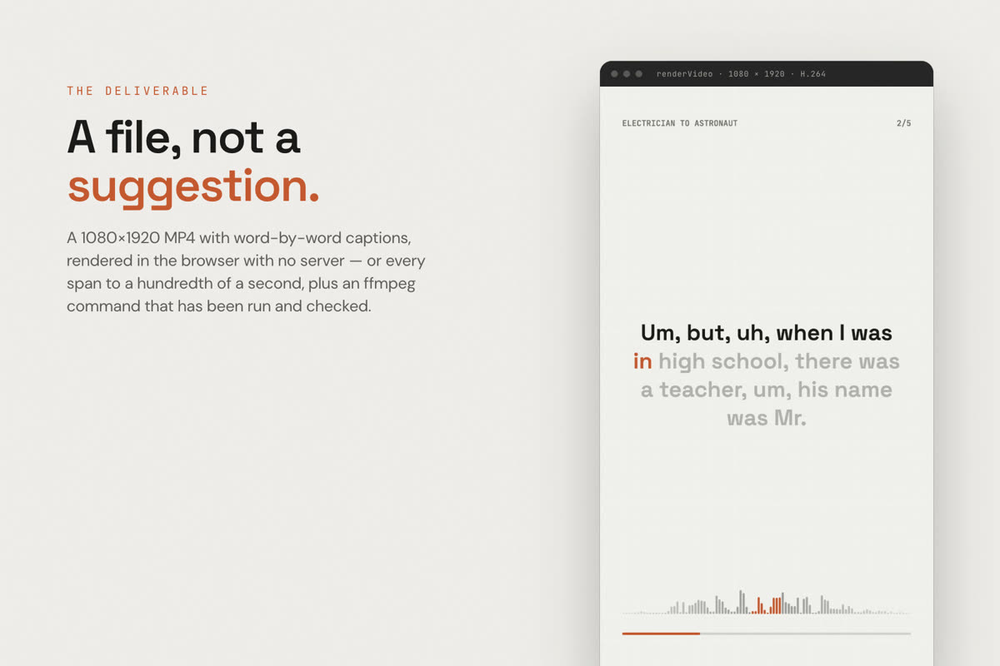

<div align="center">


# Cutroom

**Find the short inside the hour. The agent can hear; you keep the taste.**

A 38-minute podcast holds five lines that, in the right order, are a story.
Cutroom is a cutting room that hands its tools to whatever agent walks in
through WebMCP — search the transcript, *listen* to the audio for where the
voice lifts, propose a cut, play it out loud — while the person decides.

[](https://cutroom-webmcp.vercel.app/)




<sub>**[Watch the demo with sound →](https://cutroom-webmcp.vercel.app/demo.mp4)** &nbsp;·&nbsp; 2:36, narrated &nbsp;·&nbsp; built for the [WebMCP Challenge](https://webmcp.devpost.com/)</sub>

</div>

---

## What it does

You have an hour of someone talking and you need forty seconds of it that
stand on their own. That is not a search problem with an answer. It is a
judgement, and you cannot make it without hearing the candidate.

So the work splits down one line. **The agent** reads 547 lines in a second,
hears where the speaker's voice lifts above their own baseline, trims to word
boundaries and cuts on breath. **You** decide which five lines are a story,
whether that is the right kind of energy, and say "too long" after hearing it.

Cutroom registers **33 tools** on `document.modelContext`. Five of them read
the waveform rather than the words. Everything the agent does lands as a
*pending* clip with a reason on it, plays out loud, shows up in a visible
ledger, and can be undone. Nothing is committed until a person keeps it.

## Why it needs WebMCP

An agent driving this page through the DOM would scroll a 547-line transcript
and guess which `div` is the right line. With a tool it calls
`searchTranscript("the call came")` and gets `{startSec: 1122.08, endSec:
1129.78}` — an operation on the *time domain* of a recording, which no click
can express.

More to the point, the reads go **both ways**. `getReelState` does not return
a number; it returns what the person just did — which clips they voted down,
what they typed in the steer box, how far over budget they are. An agent that
answers *that* is reading taste, not executing a task. That is why this is a
WebMCP app and not a chatbot with an API: the tools have to live where the
person is listening.

## Measured, not claimed

Every figure on this page can be reproduced from the repo.

| | | Where it stops being true |
| --- | --- | --- |
| Strongest moment in the episode | **lift ×2.85 at 29:38** — *"I mean, isn't that amazing that we did that?"* | Read from the RMS envelope. A keyword search for "amazing" never ranks it. |
| `findEnergyMoments`, full pass | **1.7 ms** over 21,000 envelope samples | Envelope is built once at load; the first call pays that. |
| `getCutManifest` → ffmpeg | manifest says **30.5 s**, ffmpeg produced **30.53 s** | The command is verified against the bundled episode; yours needs the same sample rate. |
| Stitched playback, 3 jumps across the file | **25.3 s** wall clock for a 25 s cut, each clip within **0.11 s** of its boundary | 18 MB episode, fully cached by the browser. Bigger files would want range requests. |
| `cleanUpCut` on the demo cut | 4 hesitations struck, **1.1 s** saved, every one restorable | Reads Whisper's word timings; a transcript without them gets the line-level version. |
| `renderVideo` | 1080×1920 H.264 + AAC, in the browser, no server | Records in real time — a 40-second cut takes 40 seconds, and the UI says so. |
| Tools, from the registration code | **33**, `/.well-known/mcp.json` generated from `tools.js` | Regenerated by `scripts/build-manifest.mjs`; `scripts/test-webmcp.mjs` counts what the page actually registers. |

## Inside

<table>
<tr>
<td width="50%">

**It can hear**



Cutroom keeps an RMS envelope of the actual audio. `findEnergyMoments` returns
the passages where the voice lifts above its own baseline — the moment with the
most life in it, which is rarely the smartest sentence. The same envelope drives
`snapToBreath`, because a splice on top of a word sounds broken however good
the line is.

</td>
<td width="50%">

**It proposes. You decide.**



Agent clips land dashed and slate — *pending* — each with a one-line *why* on
the card, not buried in a chat log. A thumbs-down or a steer chip ("Tighter",
"Colder open") goes back through `getReelState` as `humanVote`, `humanNote`,
`humanAsked`. Pending clips still play, because a proposal you cannot hear is
worthless.

</td>
</tr>
<tr>
<td width="50%">

**Cleanup you can see**



`cleanUpCut` removes stammers, false starts and dead air from the *middle* of a
clip and closes the audio up behind them. Struck words stay visible on the card
with a one-click restore, and the export carries the omissions, so what you
hear is what ships.

</td>
<td width="50%">

**It checks its own work**



`checkFlow` reports what an editor would flag: a hook that opens mid-thought, a
join landing on speech instead of in a pause, a sentence sheared off at the
end. Each note names the tool that fixes it. Every result the demo quotes is
measured from the state it just produced, never written down in advance.

</td>
</tr>
</table>

<sub>Stills are the Devpost gallery cards in `submission/gallery`, rendered from
the live app by `film/stills.sh`.</sub>

## The deliverable

Everything upstream produces a decision — these spans, in this order.
Three ways to take it out of the browser:

- **`renderVideo`** draws the audiogram frame by frame on a canvas, muxes it
  with the real audio through MediaRecorder, and hands back a 1080×1920 MP4
  with word-by-word captions. MP4 is requested with the full codec string
  (`avc1.42E01E,mp4a.40.2`); the short forms report unsupported even where MP4
  works, which is how you ship WebM by accident. The result includes the
  one-line stream-copy that turns MediaRecorder's fragmented MP4 into one
  QuickTime always opens.
- **`getCutManifest`** gives every span to a hundredth of a second plus an
  ffmpeg command. It has been run: 30.53 s out for a manifest claiming 30.5 s.
- **`exportCut`** writes EDL, JSON, a script, or an **SRT timed against the
  finished cut** rather than the source.

<div align="center">

</div>

## The 33 tools, by job

| | |
| --- | --- |
| **Find** | `getSource` · `searchTranscript` · `readTranscript` · `findPhrase` · **`findEnergyMoments`** · `listCapabilities` |
| **Propose** | `proposeCut` · `addSpan` · `addPhrase` · `getCandidates` · `playCandidate` |
| **Shape** | `reorderClip` · `removeClip` · `trimClip` · `reshapeClip` · `setClipRole` · `fitToBudget` · **`snapToBreath`** |
| **Clean** | **`cleanUpCut`** · **`tightenClip`** · `tidyClip` · `omitPhrase` · `redactPhrase` · `redactRange` |
| **Read the person** | `getReelState` · **`checkFlow`** · `getWorkflowState` · `undoLastChange` |
| **Ship** | `playReel` · `renderVideo` · `exportCut` · `getCutManifest` |
| **Bring in** | `loadTranscript` — the agent supplies the transcript; the agent *is* the file picker |

**Bold** reads the audio, not the transcript. The full schemas are at
[`/.well-known/mcp.json`](https://cutroom-webmcp.vercel.app/.well-known/mcp.json);
an agent that can only *fetch* gets `/data/transcript.json` and
`/data/peaks.json` too, which is enough to pick real spans and return exact
timestamps.

## Try it

**Live:** <https://cutroom-webmcp.vercel.app/> — Chrome 149+ with
`chrome://flags/#enable-webmcp-testing`, or ChatGPT's browser. The pill
top-right reads **"33 tools live"** when the bridge is up. Click **What is
this?** for a scripted run of the real tools; add `?present` to step through
it by hand.

**A prompt worth trying:**

> Call listCapabilities first, then find me 60 seconds on how she went from
> electrician to astronaut. Propose two angles, play the better one, clean it
> up and give me the timestamps.

Locally there is no build, no backend, no key — it is static files.

```bash
bin/try.sh                 # serve on :4321 and open Chrome with --enable-features=WebMCP
```

```bash
bin/verify.sh              # drive all 33 tools over CDP, no model involved
```

```bash
ANTHROPIC_API_KEY=… node scripts/agent.mjs "find me 60 seconds on how she went from electrician to astronaut"
```

The last one is a minimal real agent: it reads `getTools()` from the live page,
hands those schemas to a model, executes whatever it picks through
`executeTool`, and loops. Nothing is scripted; the model chooses the calls.
(`OPENAI_API_KEY` works too.)

**Without any agent** it still works: *Suggest cuts from the text* in the Cuts
tab builds a text-only baseline — sentence boundaries, no host questions, no
lines opening on a pronoun. Play it against an agent's cut and you hear what
the agent is contributing.

<details>
<summary><b>Notes on the WebMCP API</b> — two things the docs are quiet about</summary>

<br>

Learned against Chrome 151:

- `executeTool` takes the **tool object** from `getTools()`, not its name.
- Arguments go in as a **JSON string** and the result comes back as one; your
  `{content:[{type:"text",text}]}` envelope is serialised for you.
- Chrome will not let a page start audio before the person has interacted with
  it, so an agent calling `playReel` first thing is refused. The tool says so
  rather than claiming it played.

Headers: `Permissions-Policy: tools=(self)` and `Origin-Agent-Cluster: ?1`.

</details>

<details>
<summary><b>The demo film</b> — rebuilt from the repo in two commands</summary>

<br>

```bash
bash film/build.sh         # ~6 min: motion cards, live app footage, the app's own render, score, narration
bash film/stills.sh        # gallery cards, thumbnail, public copy of the demo
```

Motion cards are HTML + GSAP rendered frame by frame with the ticker detached,
so frame N is the same pixels on any machine. App footage is the real page
running the real demo over `Page.startScreencast`; every tool call in the
ledger happened. The output beat is the app's own `renderVideo` result, and the
audio under it is the actual cut. Sound is synthesised from a seeded PRNG, so
nothing is licensed and everything is reproducible. See
[`film/README.md`](film/README.md) for the timing sheet.

</details>

<details>
<summary><b>Keyboard</b></summary>

<br>

| Key | |
|---|---|
| `Space` | Play / pause the reel |
| `1`–`9` | Jump to a candidate cut and play it |
| `K` | Keep all pending clips |
| `/` | Search the transcript |
| `⌘Z` / `⌘E` | Undo · export |
| `?` | Show all of these |
| `←` `→` `P` | Previous / next / presenter mode, while the demo is open |

</details>

<details>
<summary><b>Layout, media, design</b></summary>

<br>

```
app/
  index.html
  css/cutroom.css      design tokens + layout
  js/store.js          state, search, all mutations
  js/player.js         <audio> driven as a stitched sequence
  js/ui.js             rendering + interaction
  js/ingest.js         SRT/VTT/JSON parsing, file drop
  js/starters.js       heuristic cuts for no-agent use
  js/tour.js           the scripted demo and presenter mode
  js/tools.js          the 33 WebMCP tool definitions
  js/render.js         renderVideo — canvas + MediaRecorder
  js/analysis.js       RMS envelope, energy, breath
  js/wave.js           waveform drawing
  data/                transcript, waveform peaks, credits
  media/episode.m4a    18 MB — the whole 38 minutes
film/                  the demo film pipeline
scripts/               transcript, peaks and manifest build steps
submission/            Devpost pack: gallery, thumbnail, brand kit, copy
```

The episode is 64 kbps mono AAC, 18 MB for 38.5 minutes — small enough that
the browser caches all of it, so seeking is instant and stitched playback needs
no HLS or range tuning. Demo audio is public domain (NASA); see
[`app/data/CREDITS.md`](app/data/CREDITS.md).

Palette and type follow the QWEE design system V3 — neutral paper, ink at 74%
and 62%, hairlines — with Cutroom's two accents: terracotta is *mine*, slate is
*proposed*. Measured contrast and the reasoning are in
[`submission/BRAND.md`](submission/BRAND.md).

</details>

## Licence

MIT — see [LICENSE](LICENSE).
